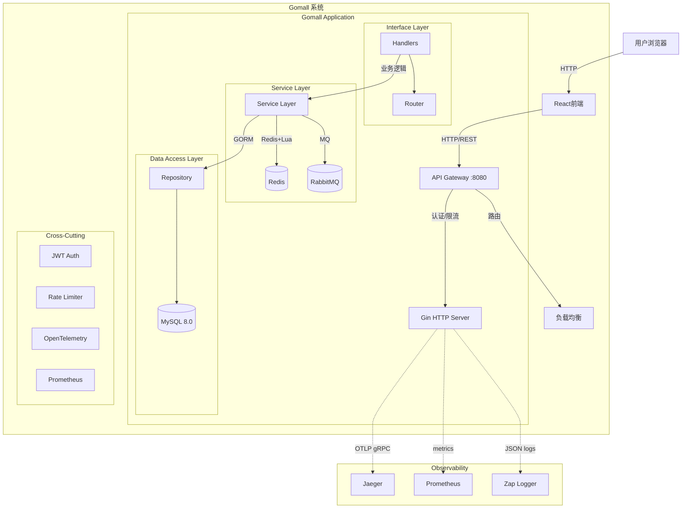

# GoMall Architecture Overview

## 1. System Architecture

GoMall 是一个从**单体架构逐步演进到微服务架构**的电商实战项目，专注于解决高并发场景下的秒杀难题。项目采用**模块化单体架构 (Modular Monolith)** 设计，虽然当前是单一部署单元，但内部结构分层清晰、模块化明确，为未来微服务拆分做好准备。

### 高层架构图



---

## 2. Technical Stack

### 后端技术栈

| 技术 | 版本 | 用途 |
|------|------|------|
| Go | 1.23+ | 后端开发语言 |
| Gin | v1.9.1 | HTTP Web 框架 |
| GORM | v1.25.5 | MySQL ORM |
| gRPC | v1.60.1 | 微服务通信 |
| Viper | v1.18.2 | 配置管理 |
| JWT | - | 认证授权 |
| bcrypt | - | 密码加密 |

### 前端技术栈

| 技术 | 版本 | 用途 |
|------|------|------|
| React | 18+ | UI 框架 |
| TypeScript | 5+ | 类型安全 |
| Vite | 5+ | 构建工具 |
| Axios | - | HTTP 客户端 |
| Zustand | - | 状态管理 |
| React Router | - | 路由管理 |

### 基础设施

| 技术 | 版本 | 用途 |
|------|------|------|
| MySQL | 8.0+ | 持久化存储 |
| Redis | 7.0+ | 缓存、分布式锁、库存计数器 |
| RabbitMQ | 3.12+ | 流量削峰、异步解耦 |

### 可观测性

| 技术 | 用途 |
|------|------|
| OpenTelemetry + Jaeger | 分布式链路追踪 |
| Prometheus | 指标采集 |
| Uber Zap | 结构化日志 |
| Swagger/OpenAPI 3.0 | API 文档 |

---

## 3. Layered Design

项目采用严格分层架构设计：

```
┌─────────────────────────────────────────────────────────────┐
│                    Interface Layer (API)                    │
│  ┌─────────────────┐  ┌─────────────────────────────────┐  │
│  │    Router       │  │           Handlers              │  │
│  │  (Gin Routes)   │  │  HTTP请求处理、参数校验、响应格式化 │  │
│  └─────────────────┘  └─────────────────────────────────┘  │
├─────────────────────────────────────────────────────────────┤
│                    Service Layer                            │
│  ┌─────────────────────────────────────────────────────┐   │
│  │              核心业务逻辑处理                          │   │
│  │  秒杀逻辑 │ 支付处理 │ 订单服务 │ 商品服务             │   │
│  └─────────────────────────────────────────────────────┘   │
├─────────────────────────────────────────────────────────────┤
│                 Data Access Layer (Repository)              │
│  ┌─────────────────────────────────────────────────────┐   │
│  │              数据库和缓存操作封装                      │   │
│  │  GORM Models │ Redis Client │ RabbitMQ Producer/Consumer│   │
│  └─────────────────────────────────────────────────────┘   │
├─────────────────────────────────────────────────────────────┤
│                    Infrastructure                           │
│  ┌──────────────┐ ┌──────────────┐ ┌──────────────────┐   │
│  │    MySQL     │ │    Redis     │ │    RabbitMQ      │   │
│  │   (持久化)   │ │   (缓存)     │ │    (异步)        │   │
│  └──────────────┘ └──────────────┘ └──────────────────┘   │
└─────────────────────────────────────────────────────────────┘
```

### 3.1 接口层 (internal/api & internal/router)

**职责：**
- 定义 HTTP 路由
- 处理 HTTP 请求/响应
- 参数校验和格式转换

**中间件：**
| 中间件 | 文件 | 职责 |
|--------|------|------|
| JWT 认证 | `middleware/auth.go` | Token 验证、用户识别 |
| 管理员认证 | `middleware/auth.go` | 管理员权限校验 |
| 限流 | `middleware/ratelimit.go` | 请求频率控制 |
| 日志 | `middleware/logger.go` | 请求/响应日志 |
| 指标 | `middleware/metrics.go` | Prometheus 指标采集 |
| 错误处理 | `middleware/error_handler.go` | 统一错误响应 |
| 参数校验 | `middleware/validator.go` | 请求参数验证 |
| CSRF 防护 | `middleware/csrf.go` | CSRF 攻击防护 |
| 安全头 | `middleware/security.go` | 安全响应头 |

**处理器 (Handlers)：**
| 处理器 | 文件 | 职责 |
|--------|------|------|
| 基础处理器 | `handler.go` | 用户、商品，订单 |
| 购物车 | `cart_handler.go` | 购物车 CRUD |
| 秒杀 | `seckill_handler.go` | 秒杀下单 |
| 认证 | `auth_handler.go` | Token刷新、改密、退出 |
| 文件上传 | `file_handler.go` | 单文件/多文件上传 |
| 微信支付 | `wechat_pay_handler.go` | 支付相关接口 |
| 健康检查 | `health_check.go` | /health, /ready |

### 3.2 服务层 (internal/service)

**职责：** 包含核心业务逻辑

**核心服务：**
| 服务 | 文件 | 职责 |
|------|------|------|
| 基础服务 | `service.go` | 公共服务抽象 |
| 秒杀服务 | `seckill.go` | 秒杀核心逻辑、Redis+Lua原子扣减 |
| 微信支付 | `wechat_pay.go` | 支付统一下单、回调处理 |

**秒杀核心逻辑：**
1. 预加载库存到 Redis
2. 用户请求先检查 Redis 库存
3. Lua 脚本原子扣减（防止超卖）
4. 扣减成功则发送消息到 RabbitMQ
5. 立即返回"排队中"
6. 后台消费者异步创建数据库订单

### 3.3 数据访问层 (internal/repository & internal/model)

**职责：**
- **Model**: 定义数据库表结构（GORM models）
- **Repository**: 封装所有数据库和缓存操作

**数据模型：**
| 模型 | 字段 |
|------|------|
| User | ID, Username, Password, Email, CreatedAt |
| Product | ID, Name, Description, Price, Stock, Status |
| Order | ID, OrderNo, UserID, ProductID, ProductName, ProductImage, Quantity, TotalPrice, Status, PayType, CreatedAt |
| OrderItem | ID, OrderID, ProductID, Quantity, Price |
| Cart | ID, UserID, ProductID, Quantity |
| Stock | ID, ProductID, Count, Version |

---

## 4. Key Workflows

### 4.1 高并发秒杀流程

```
用户请求 → Nginx/Gateway → JWT认证 → 限流检查 → Redis预检查 → Lua原子扣减
                                                                         │
                                                                         ▼
RabbitMQ ←────────────── 扣减成功 ────────────────────────────── 发送消息
                                                                         │
                                                                         ▼
异步消费者 ─────────────────────────────→ 数据库事务 → 创建订单 → 更新状态
                                                                         │
                                                                         ▼
                                                                返回"排队中"
```

**防超卖机制：**
- Redis 预检查：快速判断库存是否充足
- Lua 脚本原子扣减：保证扣减操作的原子性
- RabbitMQ 异步下单：削峰填谷，保护数据库
- 数据库最终一致性：异步消费者负责数据落库

### 4.2 购物流程

1. **浏览商品**：读取操作，Redis 缓存加速
2. **加入购物车**：Redis Hash 存储，支持高并发
3. **下单结算**：数据库事务保证原子性
4. **库存扣减**：Redis + Lua 原子操作
5. **支付**：微信沙箱支付

### 4.3 购物车流程

1. **添加商品**：用户添加商品到购物车（Redis 存储）
2. **管理操作**：修改数量、删除商品、清空购物车
3. **结算**：将购物车商品批量转为订单
4. **数据一致性**：支持软删除恢复（Revive Soft-Deleted Items），防止数量异常恢复

### 4.4 微信支付流程（沙箱环境）

```
┌─────────────┐     ┌─────────────┐     ┌─────────────┐
│  前端调用    │────▶│  后端调用    │────▶│  微信API    │
│ 统一下单API  │     │ 统一下单    │     │  处理请求   │
└─────────────┘     └─────────────┘     └─────────────┘
      │                   │                    │
      │  返回支付二维码    │  返回code_url      │  返回预支付会话标识
      │◀──────────────────│◀──────────────────│
      │                   │                    │
      ▼                   ▼                    ▼
┌─────────────┐     ┌─────────────┐     ┌─────────────┐
│  用户扫码    │     │             │     │  微信支付   │
│  确认支付    │     │             │     │  确认收款   │
└─────────────┘     └─────────────┘     └─────────────┘
                            │                    │
                            │  支付结果通知      │  异步回调
                            │◀──────────────────│
                            │                    │
                            ▼                    ▼
                     ┌─────────────┐     ┌─────────────┐
                     │  更新订单    │     │  后端验证    │
                     │  状态       │     │  签名       │
                     └─────────────┘     └─────────────┘
                            │                    │
                            │◀─── 验证成功 ──────│
                            │                    │
                            ▼                    ▼
                     ┌─────────────┐     ┌─────────────┐
                     │  返回成功    │     │  更新订单    │
                     │  给微信     │     │  状态       │
                     └─────────────┘     └─────────────┘
```

**API 接口：**
- `POST /api/pay/wechat/unified-order` - 统一下单
- `GET /api/pay/wechat/query` - 订单查询
- `POST /api/pay/wechat/close` - 关闭订单
- `POST /api/pay/wechat/refund` - 申请退款
- `POST /api/pay/wechat/notify` - 支付回调

### 4.5 限流策略

**本地限流 (golang.org/x/time/rate)：**
- 基于 IP 的内存限流
- 适合单实例部署
- 配置灵活，按端点配置不同限流策略

**分布式限流 (Redis)：**
- 使用 Redis Sorted Set 实现滑动窗口
- 适合多实例部署
- Lua 脚本保证原子操作

**限流配置：**
| 场景 | QPS | 突发 | 实现方式 |
|------|-----|------|----------|
| 全局 | 1000 | 2000 | 本地限流 |
| API | 100 | 200 | 本地限流 |
| 秒杀 | 5 | 10 | Redis 分布式 |
| 登录 | 10 | 20 | 本地限流 |

### 4.6 统一响应与错误码

**响应格式：**
```json
{
  "code": 0,
  "message": "success",
  "data": {...},
  "trace_id": "xxx"
}
```

**错误码体系：**
| 错误码范围 | 模块 |
|-----------|------|
| 0 | 成功 |
| 400-500 | 系统错误 |
| 10001-10099 | 用户模块 |
| 20001-20099 | 商品模块 |
| 30001-30099 | 订单模块 |
| 40001-40099 | 支付模块 |
| 50001-50099 | 购物车模块 |
| 60001-60099 | 秒杀模块 |
| 70001-70099 | 文件上传模块 |

### 4.7 参数校验

使用 `go-playground/validator` 进行请求验证：

```go
type RegisterRequest struct {
    Username string `json:"username" binding:"required,min=3,max=50"`
    Password string `json:"password" binding:"required,min=6,max=20"`
    Email    string `json:"email" binding:"required,email"`
}
```

### 4.8 分布式链路追踪

**OpenTelemetry + Jaeger：**
- 标准化追踪 API
- OTLP gRPC 导出器（端口 4317）
- 请求延迟跟踪
- 错误跟踪与关联
- 自定义属性（UserID、ProductID、OrderNo）
- Trace 上下文传播

---

## 5. Microservices Architecture

项目支持两种部署模式：**单体模式** 和 **微服务模式**

### 5.1 单体模式（默认）

- 单一二进制文件，包含所有功能
- 部署简单
- 适合中小流量

### 5.2 微服务模式

| 服务 | 端口 | 职责 |
|------|------|------|
| API Gateway | 8080 | 请求路由、认证、限流 |
| User Service | 8081 | 用户注册、登录 |
| Product Service | 8082 | 商品 CRUD |
| Order Service | 8083 | 订单管理 |
| Stock Service | 8084 | 库存、秒杀操作 |

**服务发现：**
- 内存注册表（单实例）
- Redis 注册表（分布式）
- 健康检查与自动注销

**服务通信：**
- HTTP/REST（API Gateway）
- gRPC（服务间通信，预留）

### 5.3 微服务架构图

```
                              ┌─────────────────┐
                              │   负载均衡器     │
                              │   (Nginx)       │
                              └────────┬────────┘
                                       │
                     ┌─────────────────┼─────────────────┐
                     │                 │                 │
                     ▼                 ▼                 ▼
            ┌──────────────┐  ┌──────────────┐  ┌──────────────┐
            │  Web前端      │  │  移动端      │  │  第三方服务   │
            └──────┬───────┘  └──────┬───────┘  └──────┬───────┘
                   │                 │                 │
                   └─────────────────┼─────────────────┘
                                     │
                                     ▼
                         ┌─────────────────────┐
                         │   API Gateway       │
                         │   (8080)            │
                         │  ┌───────────────┐  │
                         │  │ JWT认证       │  │
                         │  │ 限流          │  │
                         │  │ 路由          │  │
                         │  │ 监控          │  │
                         │  └───────────────┘  │
                         └──────────┬──────────┘
                                    │
         ┌────────────┬────────────┼────────────┬────────────┐
         │            │            │            │            │
         ▼            ▼            ▼            ▼            ▼
   ┌──────────┐ ┌──────────┐ ┌──────────┐ ┌──────────┐ ┌──────────┐
   │  User    │ │ Product  │ │  Order   │ │  Stock   │ │ Payment  │
   │ Service  │ │ Service  │ │ Service  │ │ Service  │ │ Service  │
   │  (8081)  │ │  (8082)  │ │  (8083)  │ │  (8084)  │ │  (8085)  │
   └────┬─────┘ └────┬─────┘ └────┬─────┘ └────┬─────┘ └────┬─────┘
        │            │            │            │            │
        └────────────┴─────┬──────┴────────────┴────────────┘
                           │
                           ▼
              ┌────────────────────────┐
              │     Service Registry   │
              │     (Redis/Consul)     │
              └────────────────────────┘
                           │
         ┌─────────────────┼─────────────────┐
         │                 │                 │
         ▼                 ▼                 ▼
   ┌──────────┐     ┌──────────┐     ┌──────────┐
   │  MySQL   │     │  Redis   │     │RabbitMQ  │
   └──────────┘     └──────────┘     └──────────┘
```

---

## 6. Frontend Architecture

### 技术栈

| 技术 | 用途 |
|------|------|
| React 18 | UI 框架 |
| TypeScript | 类型安全 |
| Vite | 构建工具 |
| Axios | HTTP 客户端 |
| Zustand | 状态管理 |
| React Router | 路由管理 |

### 前端目录结构

```
frontend/src/
├── main.tsx              # 应用入口
├── App.tsx               # 主组件
├── api/
│   ├── request.ts        # Axios 实例配置 + 拦截器
│   ├── user.ts           # 用户相关 API
│   ├── product.ts        # 商品相关 API
│   ├── order.ts          # 订单相关 API
│   ├── cart.ts           # 购物车 API
│   ├── seckill.ts        # 秒杀 API
│   └── types.ts          # 类型定义
├── components/
│   ├── Header.tsx        # 顶部导航栏
│   ├── Footer.tsx        # 底部
│   ├── ProductCard.tsx   # 商品卡片
│   └── CartItem.tsx      # 购物车项
├── pages/
│   ├── Home.tsx          # 首页
│   ├── Products.tsx      # 商品列表
│   ├── ProductDetail.tsx # 商品详情
│   ├── Login.tsx         # 登录页
│   ├── Register.tsx      # 注册页
│   ├── Cart.tsx          # 购物车
│   ├── Orders.tsx        # 订单列表
│   ├── Seckill.tsx       # 秒杀活动
│   └── Auth.tsx          # 认证页面
├── store/
│   └── index.ts          # Zustand store
└── styles/               # 样式文件
```

### Axios 封装

```typescript
// 请求拦截器：自动添加 JWT Token
// 响应拦截器：统一错误处理、Token 过期自动刷新
```

### 状态管理 (Zustand)

```typescript
// 用户状态：登录状态、用户信息
// 购物车状态：商品列表、数量
// UI状态：加载状态、错误信息
```

---

## 7. Observability Stack

### 7.1 健康检查

| 端点 | 用途 |
|------|------|
| `/health` | 存活探针，检查所有依赖 |
| `/ready` | 就绪探针，检查应用是否就绪 |

### 7.2 Prometheus 指标

**HTTP 指标：**
- 请求计数
- 延迟直方图
- 错误计数

**业务指标：**
- 订单创建数
- 秒杀请求数
- 用户登录数

**基础设施指标：**
- MySQL 连接数
- Redis ping
- RabbitMQ 消息数

### 7.3 结构化日志

- Uber Zap 集成
- JSON 格式（生产环境）
- 控制台格式（开发环境）
- 请求/响应日志中间件
- trace_id 关联

### 7.4 配置管理

- Viper 支持 YAML/JSON 配置
- 环境变量覆盖（`GOMALL_*` 前缀）
- SIGHUP 信号热重载

---

## 8. Security

### 认证授权

- **JWT Token**：access_token + refresh_token 双令牌
- **bcrypt 密码加密**：安全存储
- **Token 刷新**：access_token 过期可用 refresh_token 续期
- **管理员权限**：AdminAuth 中间件保护敏感操作

### 安全中间件

| 中间件 | 功能 |
|--------|------|
| CSRF | CSRF 攻击防护 |
| Security | 安全响应头 (XSS 防护等) |
| Rate Limiting | 防止暴力请求 |
| CORS | 跨域资源共享控制 |

### 文件上传安全

- 格式校验：jpg, jpeg, png, gif
- 文件大小限制
- 存储路径隔离

---

## 9. Deployment

### 部署架构

```
┌─────────────────────────────────────────────────────────────┐
│                      生产环境部署                            │
├─────────────────────────────────────────────────────────────┤
│                                                             │
│   ┌─────────────┐     ┌─────────────┐     ┌─────────────┐  │
│   │   Nginx     │────▶│  Gomall     │────▶│  MySQL      │  │
│   │  (负载均衡)  │     │  App        │     │  (主从)     │  │
│   └─────────────┘     └──────┬──────┘     └─────────────┘  │
│                              │                               │
│                        ┌─────┴─────┐                        │
│                        │   Redis   │                        │
│                        │  (集群)   │                        │
│                        └───────────┘                        │
│                              │                               │
│                        ┌─────┴─────┐                        │
│                        │ RabbitMQ  │                        │
│                        │  (集群)   │                        │
│                        └───────────┘                        │
│                                                             │
└─────────────────────────────────────────────────────────────┘
```

### Docker 部署

**单体架构：**
```bash
docker-compose up -d
```

**微服务架构：**
```bash
docker-compose -f docker-compose-microservices.yml up -d
```

**服务端口：**
| 服务 | 端口 |
|------|------|
| GoMall API | 8080 |
| MySQL | 3306 |
| Redis | 6379 |
| RabbitMQ | 5672 / 15672 |
| Jaeger UI | 16686 |
| Jaeger OTLP | 4317 |

---

## 10. Directory Map

### 后端目录

| 路径 | 用途 |
|------|------|
| `backend/main.go` | 程序入口 |
| `backend/internal/api/` | HTTP Handlers |
| `backend/internal/config/` | 配置加载 |
| `backend/internal/database/` | MySQL 连接 |
| `backend/internal/gateway/` | API 网关 |
| `backend/internal/grpc/` | gRPC 服务 |
| `backend/internal/logger/` | Zap 日志 |
| `backend/internal/metrics/` | Prometheus 指标 |
| `backend/internal/middleware/` | 中间件 |
| `backend/internal/model/` | 数据模型 |
| `backend/internal/rabbitmq/` | 消息队列 |
| `backend/internal/redis/` | Redis 客户端 + Lua |
| `backend/internal/registry/` | 服务注册发现 |
| `backend/internal/repository/` | 数据访问层 |
| `backend/internal/response/` | 统一响应 + 错误码 |
| `backend/internal/router/` | 路由配置 |
| `backend/internal/service/` | 业务逻辑 |
| `backend/internal/tracing/` | 链路追踪 |
| `backend/internal/circuitbreaker/` | 熔断器 |
| `backend/internal/security/` | 安全工具 |
| `backend/conf/` | 配置文件 |
| `backend/deploy/` | Docker 部署配置 |
| `backend/docs/` | Swagger 文档 |

### 前端目录

| 路径 | 用途 |
|------|------|
| `frontend/src/main.tsx` | 应用入口 |
| `frontend/src/App.tsx` | 主组件 |
| `frontend/src/api/` | API 接口封装 |
| `frontend/src/components/` | 可复用组件 |
| `frontend/src/pages/` | 页面组件 |
| `frontend/src/store/` | 状态管理 |
| `frontend/src/styles/` | 样式文件 |
